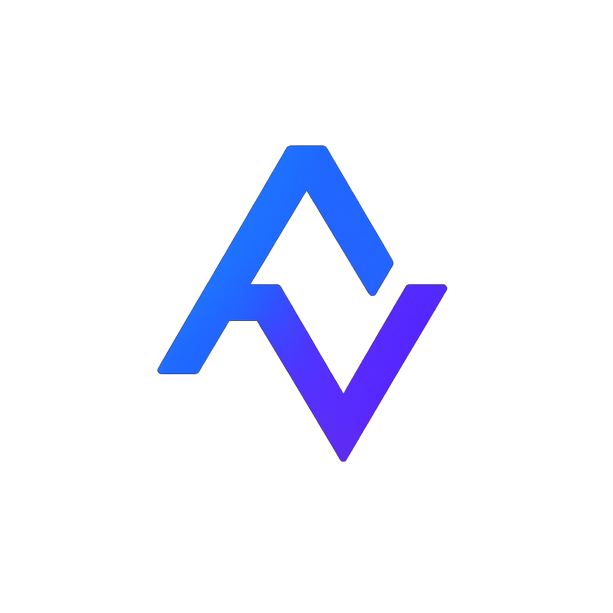

<p align="center">
  
</p>

<h1 align="center">AnyVali</h1>

<p align="center">
  <strong>Native validation libraries for 10 languages, one portable schema model.</strong>
</p>

<p align="center">
  <a href="https://github.com/BetterCorp/AnyVali/actions/workflows/ci.yml"></a>
  <a href="https://opensource.org/licenses/MIT"></a>
  <a href="https://www.npmjs.com/package/anyvali"></a>
  <a href="https://pypi.org/project/anyvali/"></a>
  <a href="https://crates.io/crates/anyvali"></a>
  <a href="https://pkg.go.dev/github.com/BetterCorp/AnyVali/sdk/go"></a>
  <a href="https://www.nuget.org/packages/AnyVali"></a>
  <a href="https://rubygems.org/gems/anyvali"></a>
</p>

<p align="center">
  <a href="https://anyvali.com">Website</a> &middot;
  <a href="https://docs.anyvali.com">Docs</a> &middot;
  <a href="https://github.com/BetterCorp/AnyVali/issues">Issues</a> &middot;
  <a href="CONTRIBUTING.md">Contributing</a>
</p>

---

AnyVali lets you write validation schemas in your language, then share them across any of 10 supported runtimes via a portable JSON format. Think Zod, but for every language.

## Why AnyVali?

- **Write schemas natively** -- idiomatic APIs for each language, not a separate DSL
- **Share across languages** -- export to JSON, import in any other SDK
- **Safe numeric defaults** -- `number` = float64, `int` = int64 everywhere
- **Deterministic parsing** -- coerce, default, then validate, in that order
- **Conformance tested** -- shared test corpus ensures identical behavior across SDKs

## Install

```bash
npm install anyvali          # JavaScript / TypeScript
pip install anyvali           # Python
go get github.com/BetterCorp/AnyVali/sdk/go  # Go
cargo add anyvali             # Rust
dotnet add package AnyVali    # C#
composer require anyvali/anyvali  # PHP
gem install anyvali           # Ruby
```

<details>
<summary>Java / Kotlin / C++</summary>

**Java (Maven)**
```xml
<dependency>
  <groupId>com.anyvali</groupId>
  <artifactId>anyvali</artifactId>
  <version>0.0.1</version>
</dependency>
```

**Kotlin (Gradle)**
```kotlin
implementation("com.anyvali:anyvali:0.0.1")
```

**C++ (CMake)**
```cmake
FetchContent_Declare(anyvali GIT_REPOSITORY https://github.com/BetterCorp/AnyVali)
FetchContent_MakeAvailable(anyvali)
target_link_libraries(your_target PRIVATE anyvali)
```
</details>

## Quick Start

Define a schema, parse input, get structured errors or clean data.

<table>
<tr><th>JavaScript / TypeScript</th><th>Python</th></tr>
<tr>
<td>

```typescript
import { string, int, object, array }
  from 'anyvali';

const User = object({
  name:  string().minLength(1),
  email: string().format('email'),
  age:   int().min(0).optional(),
  tags:  array(string()).maxItems(5),
});

// Throws on failure
const user = User.parse(input);

// Or get a result object
const result = User.safeParse(input);
if (!result.success) {
  console.log(result.issues);
}
```

</td>
<td>

```python
import anyvali as v

User = v.object_({
    "name":  v.string().min_length(1),
    "email": v.string().format("email"),
    "age":   v.int_().min(0).optional(),
    "tags":  v.array(v.string()).max_items(5),
})

# Raises on failure
user = User.parse(input_data)

# Or get a result object
result = User.safe_parse(input_data)
if not result.success:
    print(result.issues)
```

</td>
</tr>
</table>

<details>
<summary>Go example</summary>

```go
import av "github.com/BetterCorp/AnyVali/sdk/go"

User := av.Object(map[string]av.Schema{
    "name":  av.String().MinLength(1),
    "email": av.String().Format("email"),
    "age":   av.Optional(av.Int().Min(0)),
    "tags":  av.Array(av.String()).MaxItems(5),
})

result := User.SafeParse(input)
if !result.Success {
    for _, issue := range result.Issues {
        fmt.Printf("[%s] %s at %v\n", issue.Code, issue.Message, issue.Path)
    }
}
```
</details>

## Cross-Language Schema Sharing

AnyVali's core feature: export a schema from one language, import it in another.

```typescript
// TypeScript frontend -- export
const doc = User.export();
const json = JSON.stringify(doc);
// Send to your backend, save to DB, put in a config file...
```

```python
# Python backend -- import
import json, anyvali as v

schema = v.import_schema(json.loads(schema_json))
result = schema.safe_parse(request_body)  # Same validation rules!
```

The portable JSON format:

```json
{
  "anyvaliVersion": "1.0",
  "schemaVersion": "1",
  "root": {
    "kind": "object",
    "properties": {
      "name": { "kind": "string", "minLength": 1 },
      "email": { "kind": "string", "format": "email" }
    },
    "required": ["name", "email"],
    "unknownKeys": "reject"
  },
  "definitions": {},
  "extensions": {}
}
```

## Supported SDKs

| Language | Package | Status |
|----------|---------|--------|
| JavaScript / TypeScript | [`anyvali`](https://www.npmjs.com/package/anyvali) | v0.0.1 |
| Python | [`anyvali`](https://pypi.org/project/anyvali/) | v0.0.1 |
| Go | [`github.com/BetterCorp/AnyVali/sdk/go`](https://pkg.go.dev/github.com/BetterCorp/AnyVali/sdk/go) | v0.0.1 |
| Java | `com.anyvali:anyvali` | v0.0.1 |
| C# | [`AnyVali`](https://www.nuget.org/packages/AnyVali) | v0.0.1 |
| Rust | [`anyvali`](https://crates.io/crates/anyvali) | v0.0.1 |
| PHP | `anyvali/anyvali` | v0.0.1 |
| Ruby | [`anyvali`](https://rubygems.org/gems/anyvali) | v0.0.1 |
| Kotlin | `com.anyvali:anyvali` | v0.0.1 |
| C++ | `anyvali` (CMake) | v0.0.1 |

## CLI & HTTP API

Don't need an SDK? Use AnyVali from the command line or as a validation microservice.

```bash
# Validate from the command line
anyvali validate schema.json '{"name": "Alice", "email": "alice@test.com"}'

# Pipe from stdin
cat payload.json | anyvali validate schema.json -

# Start a validation server
anyvali serve --port 8080 --schemas ./schemas/

# Validate via HTTP
curl -X POST http://localhost:8080/validate/user \
  -H "Content-Type: application/json" \
  -d '{"name": "Alice", "email": "alice@test.com"}'
```

Pre-built binaries for Linux, macOS, and Windows are available on the [releases page](https://github.com/BetterCorp/AnyVali/releases). Docker image: `docker pull anyvali/cli`.

See the [CLI Reference](https://docs.anyvali.com/docs/cli) and [HTTP API Reference](https://docs.anyvali.com/docs/api) for full documentation.

## Schema Types

| Category | Types |
|----------|-------|
| **Primitives** | `string`, `bool`, `null` |
| **Numbers** | `number` (float64), `int` (int64), `float32`, `float64`, `int8`-`int64`, `uint8`-`uint64` |
| **Special** | `any`, `unknown`, `never` |
| **Values** | `literal`, `enum` |
| **Collections** | `array`, `tuple`, `object`, `record` |
| **Composition** | `union`, `intersection` |
| **Modifiers** | `optional`, `nullable` |

## Documentation

| Guide | Description |
|-------|-------------|
| [Getting Started](https://docs.anyvali.com) | Installation, API reference, examples |
| [Numeric Semantics](https://docs.anyvali.com/docs/numeric-semantics) | Why `number` = float64 and `int` = int64 |
| [Portability Guide](https://docs.anyvali.com/docs/portability-guide) | Design schemas that work across all languages |
| [SDK Authors Guide](https://docs.anyvali.com/docs/sdk-authors-guide) | Implement a new AnyVali SDK |
| [Canonical Spec](https://docs.anyvali.com/spec/spec) | The normative specification |
| [JSON Format](https://docs.anyvali.com/spec/json-format) | Interchange format details |
| [CLI Reference](https://docs.anyvali.com/docs/cli) | Command-line validation tool |
| [HTTP API](https://docs.anyvali.com/docs/api) | Validation microservice / sidecar |
| [Development](https://docs.anyvali.com/docs/development) | Building, testing, contributing |

## Repository Layout

```
.
├── docs/           Documentation guides
├── spec/           Canonical spec, JSON format, conformance corpus
├── sdk/
│   ├── js/         JavaScript / TypeScript SDK
│   ├── python/     Python SDK
│   ├── go/         Go SDK
│   ├── java/       Java SDK
│   ├── csharp/     C# SDK
│   ├── rust/       Rust SDK
│   ├── php/        PHP SDK
│   ├── ruby/       Ruby SDK
│   ├── kotlin/     Kotlin SDK
│   └── cpp/        C++ SDK
├── cli/            CLI binary and HTTP API server (Go)
├── runner.sh       Build/test/CI runner
└── site/           anyvali.com source
```

## Contributing

Contributions are welcome. Please read [CONTRIBUTING.md](CONTRIBUTING.md) before opening a pull request.

```bash
./runner.sh help       # See all commands
./runner.sh test js    # Test a specific SDK
./runner.sh ci         # Run the full CI pipeline locally
pwsh -File tools/release/build_release.ps1  # Build release artifacts with Docker
```

## License

AnyVali is licensed under the [MIT License](LICENSE).

---

<p align="center">
  <a href="https://anyvali.com">anyvali.com</a>
</p>
